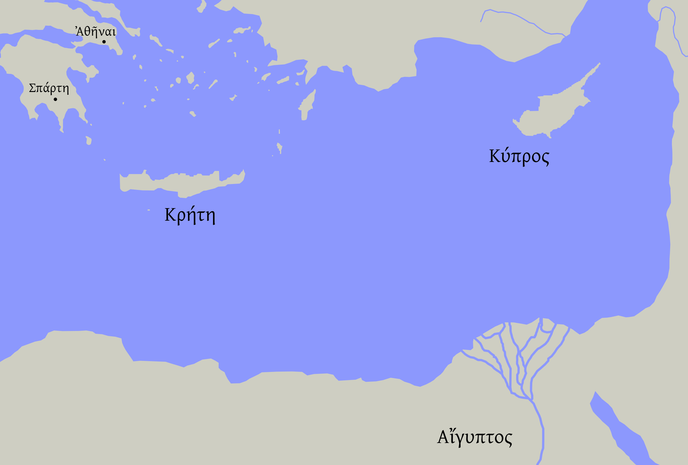
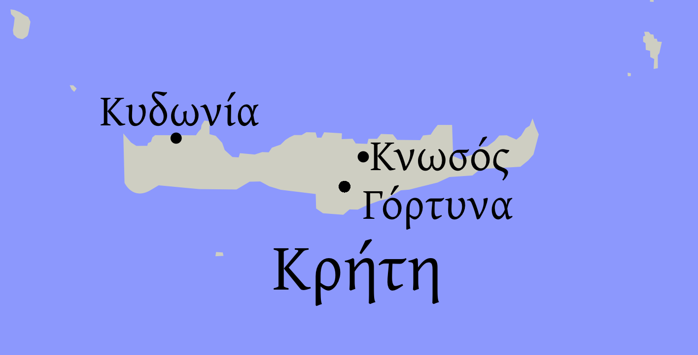
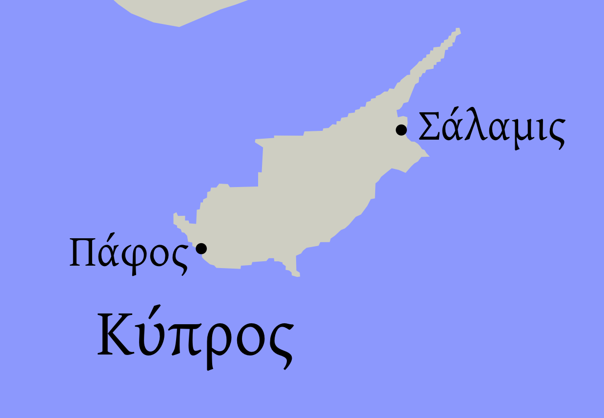
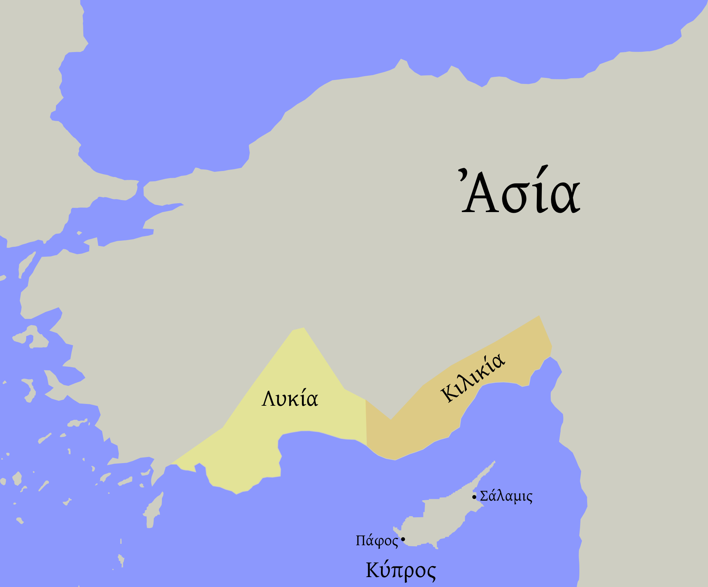
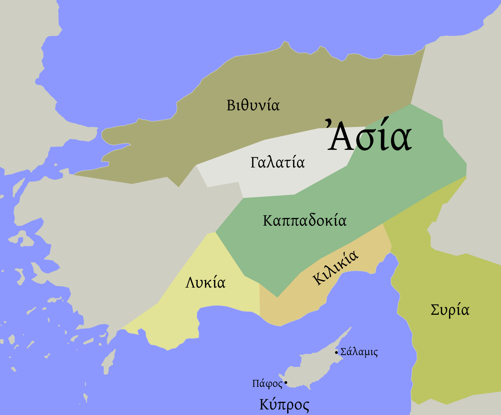
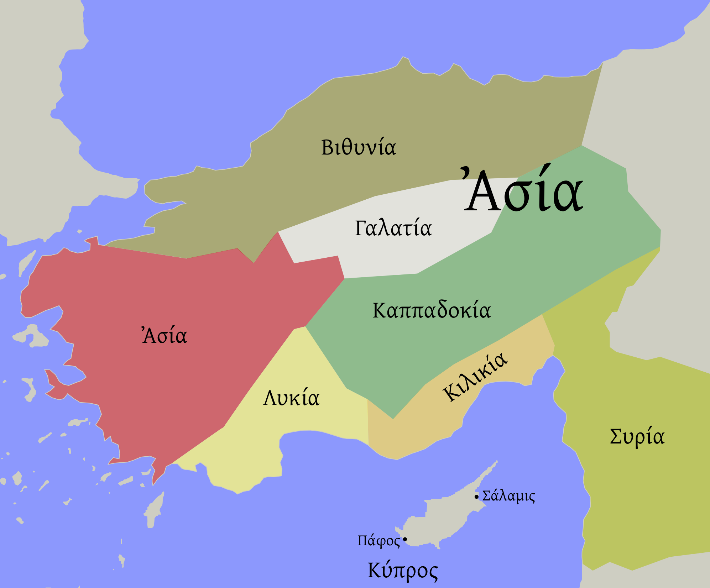

## κεφάλαιον τὸ πρῶτον

Κρήτη νῆσός ἐστιν. Κρήτη ἐν τῷ πελάγει ἐστίν. Κύπρος ἐστὶ νῆσος. Κύπρος ἐν τῷ πελάγει ἐστίν. ἡ Κρήτη καὶ ὁ Κύπρος εἰσὶν νῆσοι. Κρήτη ἐστὶν νῆσος μεγάλη. Κύπρος μεγάλη ἐστίν. ἡ Κρήτη καὶ ὁ Κύπρος εἰσὶν νῆσοι μεγάλαι. Ὤγυλος νῆσός καί ἐστιν. Κρήτη καὶ Κύπρος καὶ Ὤγυλος ἐν τῇ πελάγει. ἆρα Ὤγυλος μεγάλη ἐστιν; οὐχί, Ὤγυλος μικρός ἐστιν. 

Κνωσός ἐστιν ἐν τῇ Κρήτῃ. Κνωσός ἐστιν πόλις. Κυδωνία ἐστὶν ἐν τῇ Κρήτῃ. Κυδωνία καὶ Κνωσὸς ἐν τῇ Κρήτῃ εἰσίν. Γόρτυνα καί ἐστιν ἐν τῇ Κρήτῃ. Κυδωνία ἐστὶν καὶ πόλις. Κνωσὸς καὶ Κυδωνία καὶ Γόρτυνα πόλεις εἰσίν.

Σάλαμίς ἐστιν ἐν τῷ Κύπρῳ. Σάλαμίς ἐστιν πόλις. Σάλαμίς ἐστιν πόλις ἐν τῷ Κύπρῳ. Πάφος πόλις ἐστίν. Σάλαμις καὶ Πάφος ἐν τῷ Κύπρῳ εἰσίν.

ἆρα Σάλαμις ἐν τῇ Κρήτῃ; οὐχί, Σάλαμις ἐν τῷ Κύπρῳ ἐστίν. ἆρα Σπάρτη ἐν τῇ Κρήτῃ; οὐχί. ἆρα ἡ Σπάρτη ἐν τῷ Κύπρῳ; οὐχί, ἡ Σπάρτη ἐν τῇ Ἑλλάδι ἐστίν.

### ἐπαρχία

ἡ Λυκία ἐστὶν ἐπαρχία Ῥωμαϊκή. ἡ Λυκία ἐν τῇ Ἀσίᾳ ἐστίν. Κιλικία καὶ ἐπαρχία Ῥωμαϊκή. ἆρα Κιλικία ἐν τῇ Ἀφρικῇ; οὐχί, Κιλικία ἐν τῇ Ἀσίᾳ. ἡ Λυκία καὶ ἡ Κιλικία ἐισὶν ἐπαρχίαι Ῥωμαϊκαί. 

Καππαδοκία καὶ ἐπαρχία ἐστίν. Λυκία, Κιλικία, Καππαδοκία, Γαλατία, Βιθυνία, Συρία εἰσὶν ἐπαρχίαι Ῥωμαϊκαί. Λυκία, Κιλικία, Καππαδοκία, Γαλατία, Βιθυνία, Συρία εἰσὶν ἐν τῇ Ἀσίᾳ.

Ἀσία ἐπαρχία καὶ ἐστίν. Ἀσία ἐστὶν ἐπαρχία ἐν τῇ Ἀσίᾳ!

